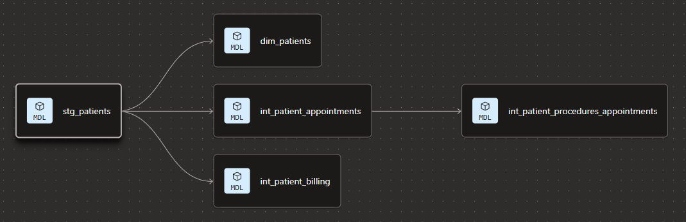
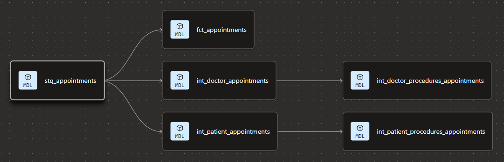
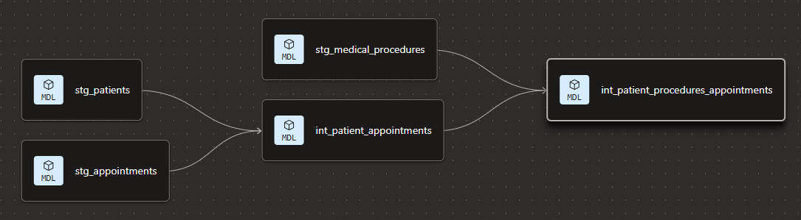

# Healthcare System Analytics

## 1. Problem Statement

Healthcare operations generate data across patients, providers, appointments, procedures, and billing. Raw data is rarely analytics-ready: it needs consistent schemas, standardized types, tested transformations, and a curated layer for BI.

This project demonstrates an end-to-end analytics workflow:

- **Ingest** healthcare-shaped CSV data into Snowflake (`ANALYTICS.RAW`)
- **Transform** the raw layer into clean, reusable models with dbt (staging -> intermediate -> marts)
- **Visualize** curated marts in Apache Superset for reporting and exploration


## 2. Business Questions

Examples of questions the modeled layer can support:

- Appointment volume over time and peak scheduling windows.
- Provider workload: appointments per doctor and specialization mix.
- Patient activity: appointment frequency and patient lists for outreach.
- Billing totals by category and high-level revenue drivers.
- Operational joins: which procedures occurred in which appointments and with which providers/patients.

## 3. Data Model Layers

### Flow


### Raw layer (Snowflake)

The dbt models expect these raw tables in Snowflake:

- Database: `ANALYTICS`
- Schema: `RAW`
- Tables (matching `data/` CSV headers):
  - `APPOINTMENTS` (`appointment_id, appointment_date, appointment_time, patient_id, doctor_id`)
  - `BILLING` (`invoice_id, patient_id, invoiced_items, amount`)
  - `DOCTORS` (`doctor_id, name, specialization, phone_contact`)
  - `MEDICAL_PROCEDURES` (`procedure_id, procedure_name, appointment_id`)
  - `PATIENTS` (`patient_id, first_name, last_name, email`)

### Staging layer (dbt)

Standardizes the raw tables into dbt-managed relations. Source queries reference `ANALYTICS.RAW.*`.

### Intermediate layer (dbt)

Creates business-friendly joins such as:

- patient <-> appointments
- doctor <-> appointments
- procedures <-> appointments (plus patient/doctor attributes)
- patient <-> billing

### Marts layer (dbt)

BI-ready dimensional model built in `ANALYTICS.MARTS`:

- Dimensions: `dim_patients`, `dim_doctors`, `dim_medical_procedures`
- Facts: `fct_appointments`, `fct_billing`

### dbt Fusion Models Lineage

**1. stg_patients**



**2. stg_appointments**



**3. int_patient_procedures_appointments**



**4. int_doctors_procedures_appointments**


## 4. Local Setup

### Prerequisites

- Snowflake account + permissions to create/use:
  - a warehouse
  - the `ANALYTICS` database
  - schemas `RAW`, `STAGING`, `INTERMEDIATE`, `MARTS`
- Python 3 (recommended for dbt + optional dataset download)
- dbt Core/Cloud + `dbt-snowflake`
- Superset (Docker recommended) for BI

### Snowflake bootstrap (example)

Run as an admin (adjust names/roles to your environment):

```sql
create warehouse if not exists ANALYTICS_WH warehouse_size = 'XSMALL' auto_suspend = 60 auto_resume = true;
create database if not exists ANALYTICS;
create schema if not exists ANALYTICS.RAW;
create schema if not exists ANALYTICS.STAGING;
create schema if not exists ANALYTICS.INTERMEDIATE;
create schema if not exists ANALYTICS.MARTS;
```

### Load CSVs to `ANALYTICS.RAW`

Use the included `data/` CSVs and load them using Snowflake UI, SnowSQL, or another loader.

### Install dbt (example)

```bash
python3 -m venv .venv
source venv/bin/activate
pip install --upgrade pip
pip install dbt-core dbt-snowflake
```

### Configure `profiles.yml`

```yml
default:
  target: dev
  outputs:
    dev:
      type: snowflake
      account: "{{ env_var('SNOWFLAKE_ACCOUNT') }}"
      user: "{{ env_var('SNOWFLAKE_USER') }}"
      password: "{{ env_var('SNOWFLAKE_PASSWORD') }}"
      role: "{{ env_var('SNOWFLAKE_ROLE', 'SYSADMIN') }}"
      database: "ANALYTICS"
      warehouse: "{{ env_var('SNOWFLAKE_WAREHOUSE', 'ANALYTICS_WH') }}"
      schema: "STAGING"
      threads: 4
      client_session_keep_alive: false
```

### Run transformations

```powershell
cd dbt
dbt deps
dbt debug
dbt run
dbt test
```

Common selectors:

- `dbt run --select staging`
- `dbt build --select marts`

### Superset (BI)


## 5. Repository Structure

```text
healthcare-system-analytics/
|-- assets/
|   |-- stg_patients.png
|   |-- architecture.svg
| 
|-- dbt/
|    |-- dbt_project.yml
|    |-- models/
|         |-- staging/
|         |-- intermediate/
|         |-- marts/
|         
|-- extract/
|   |-- extract.py             # Kaggle -> CSV
|
|-- superset/
|   |-- charts/
|   |    |-- chart 1
|   |    |-- chart 2
|   |
|   |-- dashboards/
|        |-- patients summary
|        |-- billing summary
|        |-- appointments summary

```

## 6. Contributing

Contributions are welcome!

1. Create a feature branch

   ```bash
   git checkout -b feature/xyz
   ```

2. Commit changes

   ```bash
   git commit -m "Add xyz feature"
   ```

3. Push to branch

   ```bash
   git push origin feature/xyz
   ```

4. Open a Pull Request.
